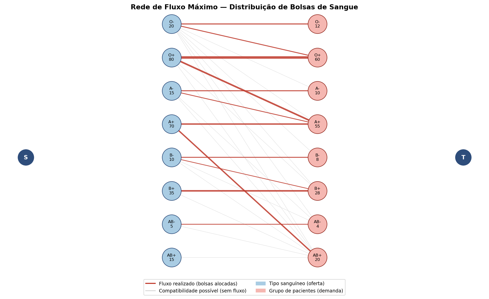
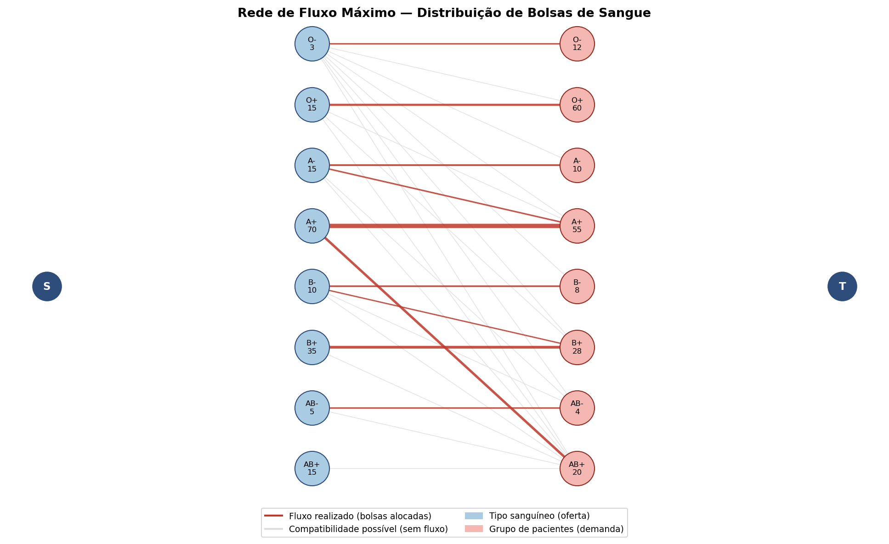

# Trabalho da 3ª Unidade — Algoritmo e Testes Computacionais

**Disciplina:** Teoria dos Grafos | **Docente:** Silvia Diniz
**Autores:** Leonardo Machado Moreira e Sérgio Manuel Alves Moreira
**UFRN — 2026**

---

## 1. Introdução

Este trabalho conclui a sequência iniciada na 1ª unidade (modelagem do problema como grafo bipartido) e aprofundada na 2ª unidade (estado da arte). Aqui, implementamos e testamos computacionalmente o modelo identificado como mais adequado para a gestão de bolsas de sangue: o **Fluxo Máximo em Redes**, resolvido pelo algoritmo de **Edmonds-Karp**.

O objetivo é demonstrar, na prática, como o algoritmo resolve o problema real de alocar um estoque limitado de bolsas de sangue (por tipo ABO/Rh) entre grupos de pacientes com demandas distintas, respeitando as regras de compatibilidade sanguínea.

---

## 2. Modelagem do Grafo

O grafo de fluxo foi estruturado em 4 camadas, conforme proposto na 2ª unidade:

| Camada | Papel | Capacidade da aresta |
|---|---|---|
| Fonte (S) → Oferta | Representa o estoque do hemocentro | Quantidade de bolsas disponíveis |
| Oferta → Demanda | Representa a compatibilidade ABO/Rh | "Infinita" (10.000) |
| Demanda → Sumidouro (T) | Representa a necessidade de cada grupo de pacientes | Quantidade de pacientes daquele grupo |

A tabela de compatibilidade implementada segue exatamente o sistema ABO/Rh documentado na 1ª e 2ª unidades (O− é doador universal; AB+ é receptor universal).

---

## 3. Algoritmo Implementado

A implementação foi feita em **Python**, sem bibliotecas externas de grafos, para que toda a lógica do algoritmo fosse explícita.

### 3.1. Estrutura de dados

O grafo residual foi representado como um dicionário de dicionários (`{u: {v: capacidade}}`), permitindo consultar e atualizar capacidades em tempo O(1).

### 3.2. Edmonds-Karp (Ford-Fulkerson com BFS)

```python
def edmonds_karp(self, fonte, sumidouro):
    fluxo_total = 0
    while True:
        pai = {}
        if not self.bfs(fonte, sumidouro, pai):
            break  # não há mais caminhos aumentantes

        # gargalo = menor capacidade residual no caminho encontrado
        gargalo = float('inf')
        v = sumidouro
        while v != fonte:
            u = pai[v]
            gargalo = min(gargalo, self.grafo[u][v])
            v = u

        # atualiza capacidades residuais (direta e reversa)
        v = sumidouro
        while v != fonte:
            u = pai[v]
            self.grafo[u][v] -= gargalo
            self.grafo[v][u] += gargalo
            v = u

        fluxo_total += gargalo
    return fluxo_total
```

A cada iteração, uma busca em largura (BFS) localiza um caminho aumentante da fonte ao sumidouro no grafo residual. O **gargalo** desse caminho (a menor capacidade residual entre as arestas percorridas) é então somado ao fluxo total, e as capacidades são atualizadas — inclusive a aresta reversa, que permite ao algoritmo "desfazer" alocações caso uma rota melhor seja encontrada depois.

**Complexidade:** O(V·E²). A rede modelada possui 18 nós (S, 8 tipos de oferta, 8 grupos de pacientes, T) e 29 arestas (8 de S→oferta, 21 de compatibilidade, 8 de demanda→T), resultando em um limite superior de O(18 × 29²) = O(15.138) operações. Na prática, o algoritmo convergiu em apenas 12 iterações no cenário normal — muito abaixo do pior caso teórico.

### 3.3. Corte mínimo (detecção de gargalo)

Quando o fluxo máximo não cobre toda a demanda, o algoritmo localiza o **corte mínimo**: após a última BFS (que falha em alcançar o sumidouro), os nós ainda alcançáveis a partir da fonte formam um lado do corte. As arestas saturadas que cruzam para o outro lado indicam exatamente qual tipo sanguíneo está em falta — informação aplicável a campanhas de doação direcionadas.

---

## 4. Testes Computacionais

Foram executados dois cenários para validar o comportamento do algoritmo.

### 4.1. Cenário 1 — Estoque normal

**Estoque:** 250 bolsas distribuídas conforme a proporção populacional brasileira (O+ é o tipo mais comum).
**Demanda:** 197 pacientes distribuídos nos 8 grupos sanguíneos.

**Resultado:** o algoritmo encontrou **12 caminhos aumentantes** e atingiu fluxo máximo de **197**, igual à demanda total — ou seja, **100% dos pacientes foram atendidos**.



Trecho do relatório de alocação gerado pelo programa:

```
[ RELATÓRIO DE ALOCAÇÃO (bolsas enviadas por rota) ]
  A+    → A+    : 22 bolsas
  A+    → AB+   : 20 bolsas
  O+    → A+    : 28 bolsas
  O+    → O+    : 52 bolsas
  O-    → O+    : 8 bolsas
  O-    → O-    : 12 bolsas
  ...
```

Esse relatório evidencia, na prática, o papel do **doador universal**: o tipo O− foi parcialmente direcionado para atender pacientes O+ (sobra de oferta), ilustrando como o algoritmo otimiza automaticamente o uso do estoque mais versátil.

### 4.2. Cenário 2 — Escassez do tipo O (doador universal)

Para testar o comportamento do algoritmo sob pressão, o estoque de O− foi reduzido de 20 para 3 bolsas, e o de O+ de 80 para 15 — simulando um período de baixa captação do tipo sanguíneo mais demandado.

**Resultado:** o fluxo máximo cai para **143** de uma demanda de **197**, deixando **54 pacientes sem atendimento**. O algoritmo identificou corretamente, via corte mínimo, que o gargalo está nos tipos **O− e O+**.



```
⚠ Estoque insuficiente para atender toda a demanda.
→ Corte mínimo (gargalo do sistema):
   Estoque insuficiente de: O-
   Estoque insuficiente de: O+
```

Esse resultado confirma, computacionalmente, a utilidade do **Teorema do Corte Mínimo (Max-Flow Min-Cut)** discutido na 2ª unidade: o sistema não apenas informa que há déficit, mas aponta exatamente qual recurso precisa ser reforçado — informação diretamente aplicável a campanhas de doação direcionadas, como mencionado na seção de aplicações reais do trabalho anterior.

---

## 5. Discussão dos Resultados

Os testes confirmam, na prática, a limitação identificada na 1ª unidade: um modelo de emparelhamento simples não distinguiria entre os dois cenários acima, pois não representa quantidade de estoque. O modelo de fluxo máximo, por outro lado, captura corretamente:

- A diferença entre "compatível" e "disponível em quantidade suficiente";
- O papel do doador universal (O−) como recurso de flexibilização do sistema;
- A identificação automática do gargalo quando a demanda não pode ser plenamente atendida.

---

## 6. Conclusão

A implementação do algoritmo de Edmonds-Karp validou, na prática, a escolha de modelo defendida na 2ª unidade: o fluxo máximo em redes é a abordagem correta para o problema de distribuição de bolsas de sangue, pois incorpora a restrição de estoque que o emparelhamento bipartido da 1ª unidade não contemplava. Os testes em dois cenários (normal e de escassez) demonstraram que o algoritmo não apenas calcula a alocação ótima, mas também diagnostica gargalos do sistema por meio do corte mínimo — uma capacidade analítica com aplicação direta em hemocentros reais.

---

## 7. Referências

As referências bibliográficas completas (Roth et al. 2005; Dillon, Oliveira e Abbasi 2017; Manlove e O'Malley 2015; entre outras) constam no documento da 2ª unidade, que fundamentou teoricamente a escolha do modelo implementado neste trabalho.

---

## Anexo — Código-fonte completo

O código completo está disponível no arquivo `blood_flow.py`, entregue em conjunto com este relatório. Para executar:

```bash
python3 blood_flow.py
```

O programa não depende de bibliotecas externas para o algoritmo (apenas `collections.deque`, da biblioteca padrão). A geração dos gráficos depende de `matplotlib` (`pip install matplotlib --break-system-packages`).
